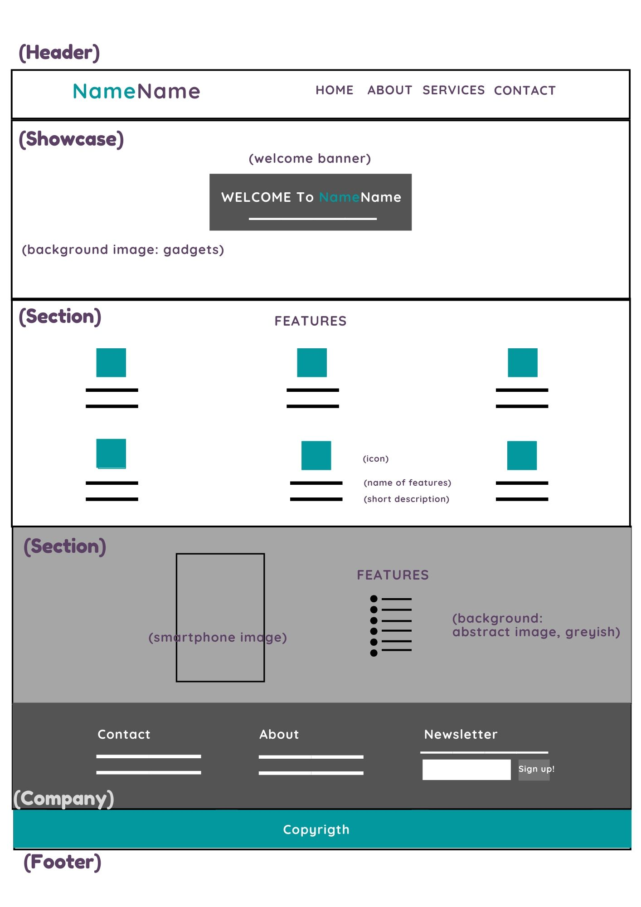
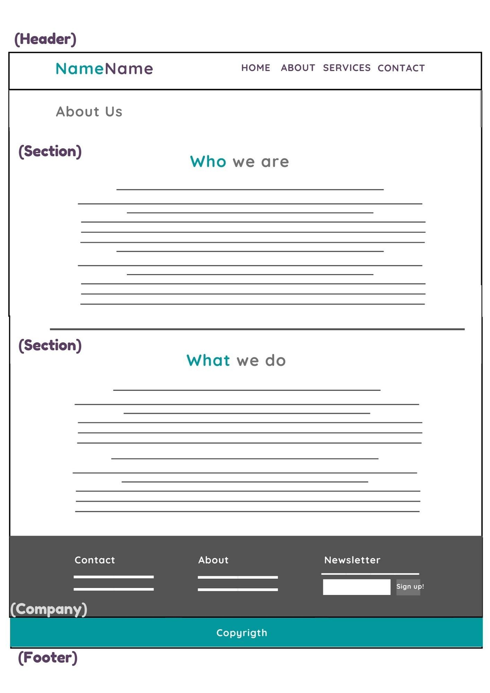
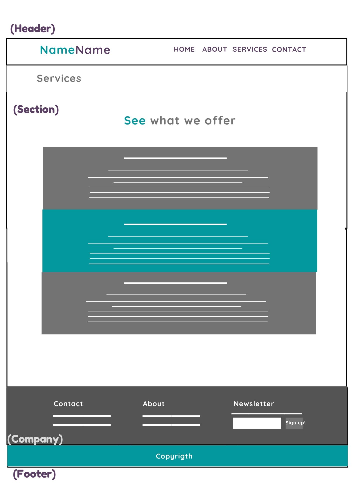
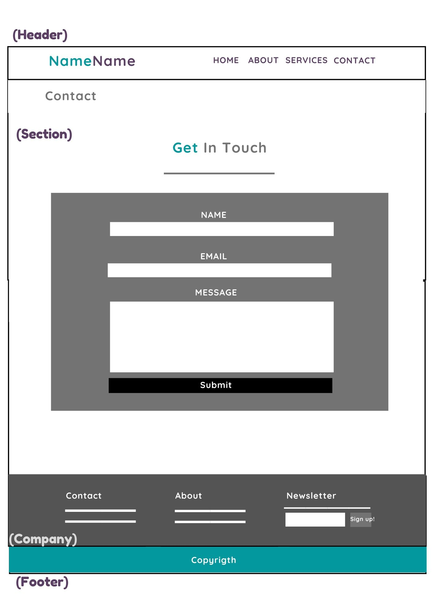

# Development Strategy

> App-theme: Code Along

* From the [**wireframe**](#wireframe) we can see the HMTL layout that will be covered in this project and then we are going to create respective styles for the websites based on the wireframes. 
* Here you can also see how the project is developed step by step (0-x) as per Agile values, through [**branches**](#0.set-up) that each contains a user story or persona in marketing (visitor perspective and their needs). We can see what has to be done in each branch in order to answer to the user story and its needs. Then we apply it to the development our pages.

---

## Wireframe

**Homepage** 
 
 

**About page** 

 

**Services page** 

 

**Contact page** 

 

---

## 0.Set-Up

__A User can see my initial repository and live demo__

### Repo : Master Branch

1. Generate an new repo from this [Template](https://github.com/adekimpianna/w3-validation-template)
1. Clone the repo
1. Write initial, basic README
1. Write `development-strategy.md`
1. Add wireframes
1. Push the change to Github
1. Turn on GitHub Pages

---

## 1. User story: Landing on the homepage

_As a site visitor, I want to know what website I am seeing, to whom (or to which company) it belongs to and a small info about them_

### Branch(es)

1. Create an issue related to this user story on Github and assign self.
1. Add a branch named `1-introduction`
2. After html and css are done, commit
3. Adjust `development-strategy.md` for next development, if needed
4. Push the changes
4. Pull request and merge it on Github

### HTML

1. Put up the title on head and other meta families (including fontawesome script)
1. Create header: company logo/name, nav
1. Create a company section:  contacts, about us, newsletter with sign up button
1. Create footer: copyright

### CSS

1. Create a separate css file
1. Insert css sheet: flexboxgrid
2. Add styling on new elements

---

## 2. User story: More about the business specialties

_As a site visitor, I want to know more about their business inclusions or the advantages if I have a business with them_

### Branch(es)

1. Create an issue related to this user story on Github and assign self.
1. Add a brach named `2-features`
2. After html and css are done, commit
3. Adjust `development-strategy.md` for next development, if needed
4. Push the changes
4. Pull request and merge it on Github

### HTML

1. Add a gig: showcase section (the welcome banner, to indicate the business)
2. Add two sections with core features of the business:
   * core features on column
   * and visual core features with image

### CSS

Add styling on new elements

---

## 3. User story: More about the company

_As a site visitor, I want to know the history of this company and what they do_

### Branch(es)

1. Create an issue related to this user story on Github and assign self.
1. Add a brach named `3-about`
2. After html and css are done, commit
3. Adjust `development-strategy.md` for next development, if needed
4. Push the changes
4. Pull request and merge it on Github

### HTML

1. Use header, company section and footer from the landing page#
1. Add sub header section with the title of the page
1. Add two sections: who we are and what we do

### CSS

Add styling on new elements

---

## 4. User story: More about the available services they offered

_As a site visitor, I want to know what services I can buy from them_

### Branch(es)

1. Create an issue related to this user story on Github and assign self.
1. Add a brach named `4-services`
2. After html and css are done, commit
3. Adjust `development-strategy.md` for next development, if needed
4. Push the changes
4. Pull request and merge it on Github

### HTML

1. Use header, company section and footer from the landing page
1. Add sub header section with the title of the page
1. Add a section to show services available from the company

### CSS

Add styling on new elements

---

## 5. User story: Interested in their services

_As a site visitor, I am interested in their business/services (but I dont know the prices) so I want to reach them_

### Branch(es)

1. Create an issue related to this user story on Github and assign self.
1. Add a brach named `5-contact`
2. After html and css are done, commit
3. Adjust `development-strategy.md` for next development, if needed
4. Push the changes
4. Pull request and merge it on Github

### HTML

1. Use header, company section and footer from the landing page
1. Add sub header section with the title of the page
1. Add a get-in-touch form to be filled out by prospective clients

### CSS

Add styling on new elements

---

## 6. Finishing Touches

### Branch(es)

1. Create an issue related to this user story on Github and assign self.
1. Add another branch named `6-final-touches`
1. Check the content, HTML, CSS and add responsive design, if not yet.
1. Validate the code to check for any last mistakes, **fix it**.
1. Write final, complete README and last touch on `development-strategy.md`, if still needed, not about the development/steps itself but maybe add wireframes or check typo.
1. Push the changes
1. Pull request and merge it after all is done.